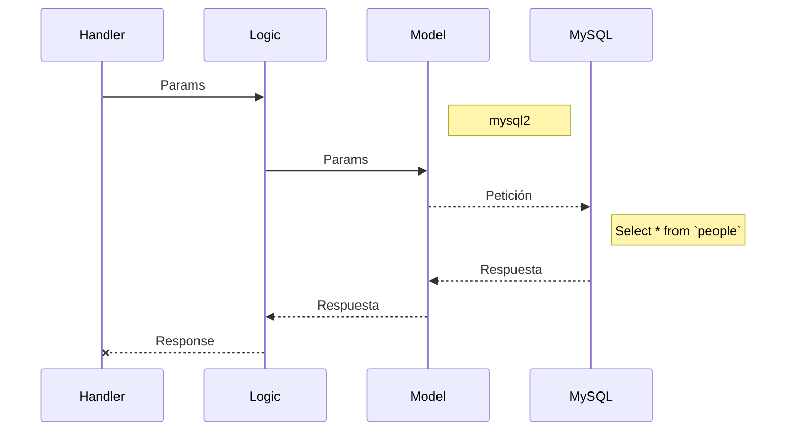

# listPeople - GET

Funcionalidad que retorna el listado de personajes

## Parámetros

- hair_color (opcional)
- offset
- nextToken

## Respuesta

```json
[
    {
		"id": 1,
		"name": "Luke Skywalker",
		"birth_year": "19 BBY",
		"eye_color": "Blue",
		"gender": "Male",
		"hair_color": "Blond",
		"skin_color": "Fair"
	},
    ...
]
```

## Base de datos

- Se usa la tabla `people`


## Lógica de negocio

...
...


## Funcionalidad


