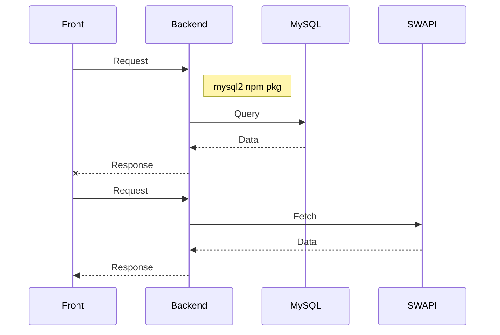

# ¡Bienvenido al proyecto Starwars!

Este es un ejemplo sencillo y muy básico que utiliza el framework Serverless, el patrón de arquitectura de microservicios, base de datos mysql, jest, github actions y AWS.

## Ver videos explicativos

- https://www.loom.com/embed/29e32240f24e4369b96b56d923432363

- https://www.loom.com/embed/8081d62a06f845ca907394854ba4a35f

## Pre-requisitos

- Nodejs
- MySQL
- Crear BD llamada starwars

## Instalación

```sh
npm i
```

## Crear .env.local dentro de la carpeta utils

```txt
HOST=<<mysql host>>
USER=<<usuario mysql>>
BD=starwars
```

## Deploy

Solo pusheando a la rama.

Se ejecutará el workflow definido y hará las pruebas y el deploy a aws.

## Documentación SwaggerUI

- http://example-sw.s3-website-us-east-1.amazonaws.com/index.html


## Funcionalidad


