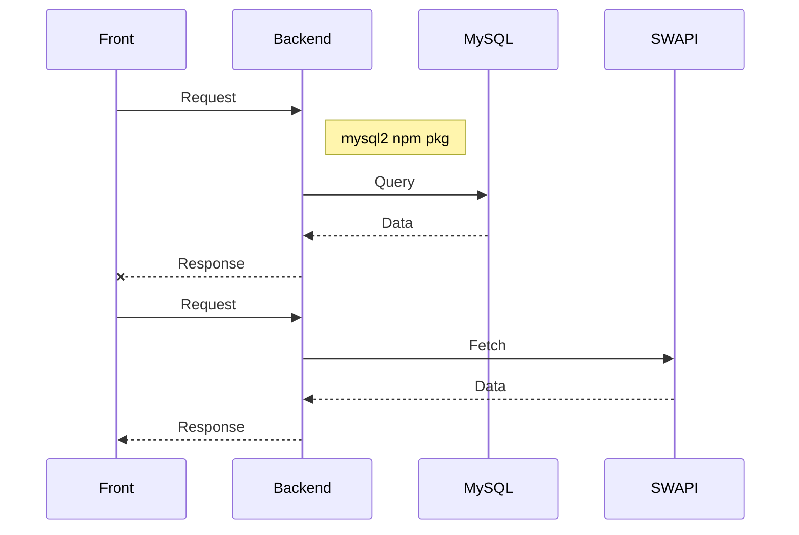

# ¡Bienvenido al proyecto Starwars!

Este es un ejemplo sencillo y muy básico que utiliza el framework Serverless, el patrón de arquitectura de microservicios, base de datos mysql, jest, github actions y AWS.

## Ver video explicativo

https://loom.com/video/sdfsdfsdfds

## Pre-requisitos

- Nodejs
- MySQL
- Crear BD llamada starwars

## Instalación

```sh
npm i
```

## Crear .env.local

```txt
HOST=<<mysql host>>
USER=<<usuario mysql>>
BD=starwars
```

## Deploy

Solo pusheando a la rama.

Se ejecutará el workflow definido y hará las pruebas y el deploy a aws.


## Funcionalidad


