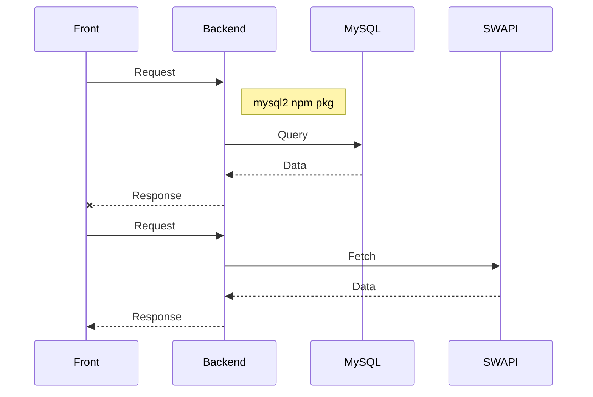

# Guía de desarrollo

Esta guía tiene como objetivo plantear buenas prácticas para el desarrollo de funcionalidades en Smiledu

## Documentación SwaggerUI

-   http://swagger-doc-smiledu.s3-website-us-east-1.amazonaws.com/

## Funcionalidad



---

Correr en local los queues, 1x1

requisitos:

- docker

- localstack desktop

```bash
cd q_email
serverless deploy --stage local
```
---

# Rules

## Código

1.1 Usar Types, no interface

1.2 Tipar todo, no usar `any` mas que para catch o casos aprobados por el equipo.

1.3 No dejar variables sin utilizar.

1.4 Enviar como parámetros objetos, cuando sean 4+ parámetros.

1.5 Máximo 1 función por archivo.

1.6 Poner `types` genéricos en `libs/types`

1.7 Usar la función `log` y no `console.log`

1.8 Si desean crear funciones para facilitar la lectura o quitarle responsabilidad a una función y hacerla más pequeña, la pueden crear a la misma altura que handler, logic, model. Por ejemplo `validations.ts`

1.9 Si el `libs` crece, organizarlo por carpetas respetando la regla `1.5`

1.10 No `global.MI_VARIABLE_GLOBAL` ahora `export const URL: string = process.env.URL;` o `export const URL_NEW: string = 'https://...';`

1.11 No importar nada fuera de la carpeta de la función mas que de `libs/`

1.12 Incluir colegio en los logs

1.13 No se invocaran lambdas directamente, la comunicacion de microservicios se hara por SQS y se debe enviar el caller para indificar quien registro un mensaje en la cola.

1.14 uso ES6

## Documentación

2.1 Documentar cada carpeta con un readme.md

2.2 Documentar cada microservicio con un readme.md

2.3 Documentar cada función de código con `JSDoc`

## Tests

3.1 Escribir pruebas unitarias (definir alcance)

## Infraestructura

4.1 Ya no se va a depender de la extension .pe .com para test/prod sino variables de entorno.

## Librerías npm

## Github

### Ramas

### Commits

### Pull requests

### Code reviews

1. Listado de que revisar

### Pendientes

1. Mantener actualizado el node y las librerías
